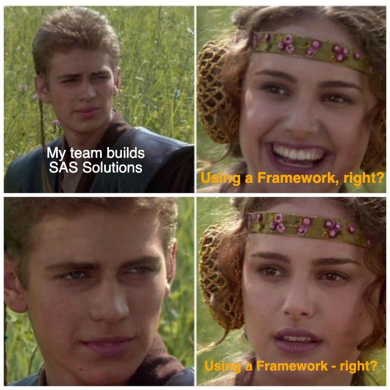

Reasons to use a framework:

* Faster on-boarding of new developers
* Project Documentation & Testing
* Support for multiple platforms
* Pre-configured linting rules
* CI/CD, out of the box
* Faster development
* Maintainability
* Build tooling
* Community

If your #SAS project is running late, costing more than expected, or failing to deliver - it's very possible that far too much time is being spent on:

* The HOW rather than WHAT should be done
* Investigations / debugging
* Fixing regressions
* Manual re-runs
* Deployment

As a project manager or sponsor of a SAS project, you should absolutely expect your developers to push the following to your GIT repo(s):

* Updates to documentation with every sprint
* Updates to tests with every sprint
* Linting rules / lint fixes
* CI/CD pipelines

If this isn't the case, they're probably building everything manually in SAS Drive / SAS Studio - which is worth a conversation. There are some excellent reasons teams end up there (tooling constraints, legacy process, or simply no framework in place) - and [SASjs](https://sasjs.io) exists precisely so that adopting one is a few commands, not a rewrite:

* [SASjs CLI](https://cli.sasjs.io) - DevOps, Documentation & Testing
* [SASjs Core](https://core.sasjs.io) - Macros for all flavours of SAS
* [SASjs Lint](https://cli.sasjs.io/lint) - Quality check your SAS code
* [SASjs Adapter](https://adapter.sasjs.io) - JS connectivity library
* [SASjs Server](https://server.sasjs.io) - Build Apps on Base SAS

Plus [Seed Apps](https://cli.sasjs.io/create) to quick start your development journey.

#sasviya #devops #sashackathon

<!--
LinkedIn version (paste as first comment under the LinkedIn post):

Reasons to use a framework:

* Faster on-boarding of new developers
* Project Documentation & Testing
* Support for multiple platforms
* Pre-configured linting rules
* CI/CD, out of the box
* Faster development
* Maintainability
* Build tooling
* Community

If your #SAS project is running late, costing more than expected, or failing to deliver - it's very possible that far too much time is being spent on:

* The HOW rather than WHAT should be done
* Investigations / debugging
* Fixing regressions
* Manual re-runs
* Deployment

As a project manager or sponsor of a SAS project, you should absolutely expect your developers to push the following to your GIT repo(s):

* Updates to documentation with every sprint
* Updates to tests with every sprint
* Linting rules / lint fixes
* CI/CD pipelines

If this isn't the case, they're probably building everything manually in SAS Drive / SAS Studio - which is worth a conversation. There are some excellent reasons teams end up there (tooling constraints, legacy process, or simply no framework in place) - and SASjs exists precisely so that adopting one is a few commands, not a rewrite.

#sasviya #devops #sashackathon
-->
