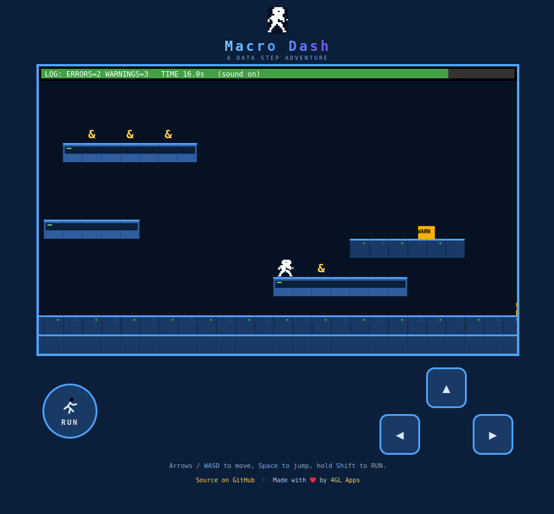

[Macro Dash](https://dash.sasjs.io) is a free, open-source platformer built with the SASjs framework. You are the DATA stepper: bounce through the WORK library, stomp ERRORs and WARNINGs, collect ampersands, grab the FORMAT 10.2 mushroom for super jumps, and get your report to the portal before the job runs out of steam. One run, all levels - amps, health and the speedrun clock carry over. Finish with 0 ERRORs and 0 WARNINGs for the clean-log stamp, then put your SYSUSERID on the dashboard.

Play it right now: **[dash.sasjs.io](https://dash.sasjs.io)**. It runs on desktop (arrows/WASD, Space to jump, hold Shift to RUN) and mobile (on-screen controls) - the repo is at [github.com/sasjs/macro-dash](https://github.com/sasjs/macro-dash).


## But it is not really a game

Behind the pixels, Macro Dash is a working demonstration of how to craft and deploy **data-powered web apps on SAS** - the same architecture behind production applications like [Data Controller](https://datacontroller.io):

- **A frontend** (plain HTML/JS canvas, strict CSP, no framework) streamed directly from SAS - no separate web tier to build, secure or maintain.
- **Backend services written in SAS** (`sasjs/services/`) that receive tables from the browser, run SAS code, and return JSON. The game uses three: `configure`, `getscores`, `savescore` - a complete, persistent, server-side leaderboard.
- **One codebase, every flavour of SAS**: deploy to SAS Viya, SAS 9 EBI or [SASjs Server](https://github.com/sasjs/server) with a single command (`sasjs cbd`), using [@sasjs/cli](https://github.com/sasjs/cli) and the [@sasjs/core](https://github.com/sasjs/core) macro library.
- **Graceful degradation**: with no backend reachable, the game falls back to localStorage mode (personal best, no leaderboard) - the same pattern you want in resilient production apps.

If you can build this, you can build a data capture form, an approvals workflow, a parameter manager or a reporting portal on your own SAS platform. The design decisions are documented in `PLAN.md` and `AGENTS.md`; the services are deliberately small and readable.

## Deploy to SAS Viya in one line - no install

Every release ships a single self-contained deploy script - `macro-dash-viya.sas` - that streams the frontend and installs the backend services straight onto the SAS Files Service. No Node, no `@sasjs/cli`, no build step: run it from SAS Studio, SAS Enterprise Guide, or any batch SAS session.

```sas
%let apploc=/your/viya/folder;
filename md url "https://github.com/sasjs/macro-dash/releases/latest/download/macro-dash-viya.sas";
%inc md;
```

That is the whole deployment. Set `apploc` to wherever you want the app to live on the Files Service (it is created if it does not exist), and the script does the rest: uploads the streamed `MacroDash.html` + assets, registers the `configure` / `getscores` / `savescore` services, and prints the app URL when done:

```
<SAS Viya base>/SASJobExecution?_FILE=/your/viya/folder/services/MacroDash.html
```

Open that URL and the game loads. On first visit you get an in-game **configuration screen** - pick a results folder for the leaderboard (a physical folder SAS can write `scores.sas7bdat` to), optionally choose the compute context and a `runAsTask` / `useComputeApi` execution mode, and submit. The `configure` service writes `settings.sas` into your apploc and flips `configured="true"` in the streamed `MacroDash.html`, so every subsequent load skips setup and the leaderboard is live for everyone.

## Deploy from source / to other platforms

The release artefact is built by CI from `sasjs/` on every push to `main`. To build and deploy directly from a checkout (e.g. for SAS 9 or SASjs Server, or to push to Viya without the release script), the targets live in `sasjs/sasjsconfig.json`:

```bash
sasjs cbd -t viya      # or: sas9 | server
```

`sasjs cbd` compiles the macros + services, builds the streaming web bundle, and deploys a service pack to the target's `appLoc` in one shot. The `serverUrl` is left blank in the shipped config - set it to your own SAS Viya / SASjs Server instance (and adjust `appLoc`, `contextName`, etc.) before deploying. The public game on [dash.sasjs.io](https://dash.sasjs.io) is the backend-free GitHub Pages build.

## Local development (no SAS required)

```bash
npm install
npm run devsetup
```

`devsetup` downloads the `@sasjs/server` binary for your platform, writes a `.env` (desktop mode, JS runtime - no SAS installation needed), starts the server on port 5000, deploys the app (`sasjs cbd -t local`) and the JS mocks, then prints the URL:

**http://localhost:5000/AppStream/MacroDash/**

The four backend services are executable JS mocks that shadow the `.sas` services, so the leaderboard works end-to-end against a local SASjs Drive - no SAS licence required to develop.

## Summary

Macro Dash is a fun way to see what SASjs makes possible. Play it at [dash.sasjs.io](https://dash.sasjs.io), and if you would like to build data-powered apps on your own SAS estate - or partner with us on a project - [get in touch](/contact).

---
