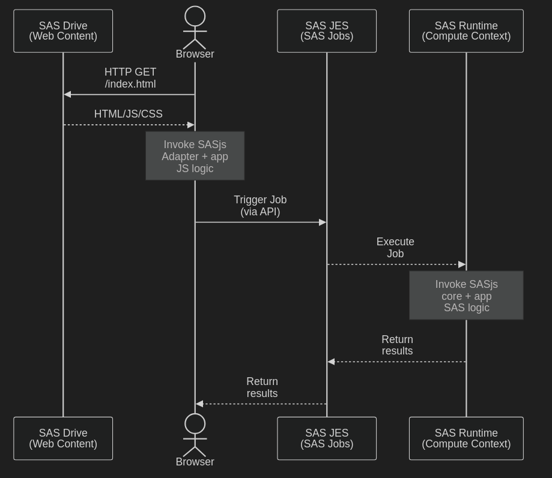

What is a SASjs Web App and how does it integrate with a SAS Viya data platform?  A reasonable question from a SAS Administration team.  This article delves into the specifics of a typical SASjs Web App, deployed to a standard SAS Viya 2025 instance.

## Introduction

4GL is a boutique software company with a singular focus on building browser-based applications for SAS platforms. Along with greenfield developments we offer migration of existing SAS 9 Web Apps to Viya, and modernisation of legacy SAS AF/SCL desktop applications.

When not working on customer projects, we are extending our own products - [Data Controller](https://datacontroller.io) (a data ingestion tool for SAS) and SASjs.

SASjs is both a set of open-source tools as well as an _opinionated framework_ for the deployment and delivery of web applications on SAS platforms.  The core components are:

 - SASjs [Core](https://github.com/sasjs/core) - a SAS macro library
 - SASjs [Adapter](https://github.com/sasjs/adapter) - a Javascript library
 - SASjs [CLI](https://github.com/sasjs/cli) - a command-line tool for testing, linting, and performing build compilations and deployments

Our apps capitalise upon the advantages of the SASjs framework to both accelerate and de-risk web app development projects.

## Architecture

Our SAS Viya web apps typically comprise of a _frontend_ (static web content) deployed to SAS Drive, that uses the SASjs _adapter_ to invoke the _backend_ (SAS code in Viya Jobs).

The deployed components consist of:

 - Web content (.html, .css, .js, .png files etc)
 - Jobs (SAS code)
 - Compute Context (under which the jobs run)
 - Filesystem content (.sas7bdat files, logs etc)

SASjs web apps on Viya do NOT require:

 - Administrator access (except for the Compute Context config)
 - A dedicated web server
 - Filesystem access
 - Terminal access

## Frontend Development

The web app is built locally, on the developer's machine, often using mocked responses to simulate a real SAS Viya server.  Typically we build using the React framework, over this [baseline repository](https://github.com/sasjs/react-seed-app).

Here are some of the steps taken to improve security at build time:

 - **NPM Audit**. We [check dependencies](https://github.com/sasjs/react-seed-app/blob/main/.github/workflows/build.yml#L25) for CVEs and other issues with every build.  The automated build will fail if there are any critical errors or warnings.
 - **Type Safety**.  Apps are built with TypeScript in Strict mode to prevent mis-allocated variables.
 - **Adapter Input Sanitation**.  The content that is sent to SAS is normalised into "table format", so that columns have specific types (char/numeric) and lengths. The adapter does not have the ability to enable "URL variables" so preventing their accidental and potentially dangerous resolution in SAS code.
 - **Semantic Releases**.  Every release is numbered according to the [conventional commit](https://www.conventionalcommits.org/en/v1.0.0/) standard, making it easy to see what was changed on a release by release basis
 - **Opinionated Framework**. SASjs is designed to mitigate the risk of code injection by ensuring that all data communication happens through the [adapter](https://github.com/sasjs/adapter), which ensures a specific format of data interchange (see the project [README](https://github.com/sasjs/adapter/blob/master/README.md)).
 - **Isolated Environment**.  The build happens locally, or in a pipeline, never on the SAS platform itself.

## Backend Development

The backend for a SASjs Viya web app is a series of self-contained Viya Jobs, containing regular SAS code.  These jobs perform the backend logic and data processing needs of the frontend app.

The SASjs framework ensures that all jobs are documented (as macros must be listed in the header in order to be compiled) and organised by reference to a central [configuration file](https://cli.sasjs.io/sasjsconfig/).

Points to note from a security perspective:

- **Input sanitation**.  Standard macros are used to parse the input files and create corresponding datasets in the WORK library for further processing.
- **Testing suite**.  [Tests](https://cli.sasjs.io/test/) can be created for Jobs, Services and Macros, and test coverage is measured in every compile.
- **Linting**.  The [lint](https://cli.sasjs.io/lint/) feature scans code for non-printable characters, SAS001/2 encoded passwords, nested macros, and other nasties.
- **Strict Mode**.  Our [mp_init()](https://core.sasjs.io/mp__init_8sas.html) macro, which implements a defensive set of SAS options, is typically used in every callable job

## Build Process

The build / development process may be performed on a laptop, or in a pipeline.  The goal of the build is to prepare the app in such a way that makes it easy to deploy - especially given that this is often done by a completely different individual or team.

The flow typically looks like:

 - Build frontend
 - Compile the project (per SASjs Config)
 - Remove tests (eg if a production deploy)
 - Build the project (per SASjs Config) for deployment
 - Share the deployment assets with the administrator

## Deploy Process

There are two ways to deploy a SASjs app on SAS Viya:

1.  Using the SASjs CLI directly
2.  Using a SAS Deployment Program (generated using the CLI)

To use the **CLI approach**, run the [authenticate](https://cli.sasjs.io/auth/) and the [deploy](https://cli.sasjs.io/servicepack) commands.  This will require a client/secret pair, and is performed from a laptop or an isolated pipeline.  The deploy process makes exclusive use of standard Viya APIs, and will create the necessary folders / deploy the Jobs and frontend Files.

The **SAS Program Deployment approach** simply means, running the SAS code in SAS Studio.  The program can be very big, as it will contain the entire frontend, as well as all the SAS Services and Jobs (and if no production, Tests).  Each Job and frontend File are deployed one by one using the Viya APIs, invoked by SAS code.  **No client/secret is required**, as the SAS session will make use of the `oauth_bearer=sas_services` setting in `proc http`.  The deployment macros are listed [here](https://core.sasjs.io/dir_f3c9615c6d389fd64e9075885fcd8e6e.html).

## Production Environment

Once in Production, a SASjs app benefits from a number of protections:

 - Uses **standard SASLogon** (corporate auth)
 - **Static Content**.  The frontend (html, css, js, png) is deployed entirely to SAS Drive (files service).  There are zero "running services" to deploy outside of SAS.
 - The frontend is ONLY **visible once authenticated** and authorised.
 - Strict **Content Security Policy**.  By default, Viya enforces a very tight ruleset on web content and this cannot be bypassed.
 - **NOXCMD** by default
- **No filesystem dependency for SAS code**. The SASjs compilation process ensures that every job is fully self-contained - so is not vulnerable to code changes on the filesystem.
- **No internet dependency**.  Apps are always designed to work without external dependencies such as fonts, images, JS libraries etc.
- The SASjs Adapter makes exclusive use of **SAS Viya APIs**.  These include:
  - `DELETE /compute/sessions/${id}`
  - `GET /compute/contexts`
  - `GET /compute/sessions/${id}/jobs/${id}`
  - `GET /compute/sessions/${id}`
  - `GET /folders/folders/@item`
  - `GET /identities/users/@currentUser`
  - `GET /jobExecution/jobs/${id}`
  - `POST /compute/contexts/${id}/sessions`
  - `POST /compute/sessions/${id}/jobs`
  - `POST /jobExecution/jobs`

## Summary

The SASjs web apps we produce are always:

 - Appropriately licenced - no copyleft components
 - Contained entirely in a standard Viya install
 - Version controlled
 - Easy to deploy
 - Documented
 - Accessible
 - Tested
 - Secure

Do [reach out](/contact) for further information, or clarifications on the build / deployment process.
